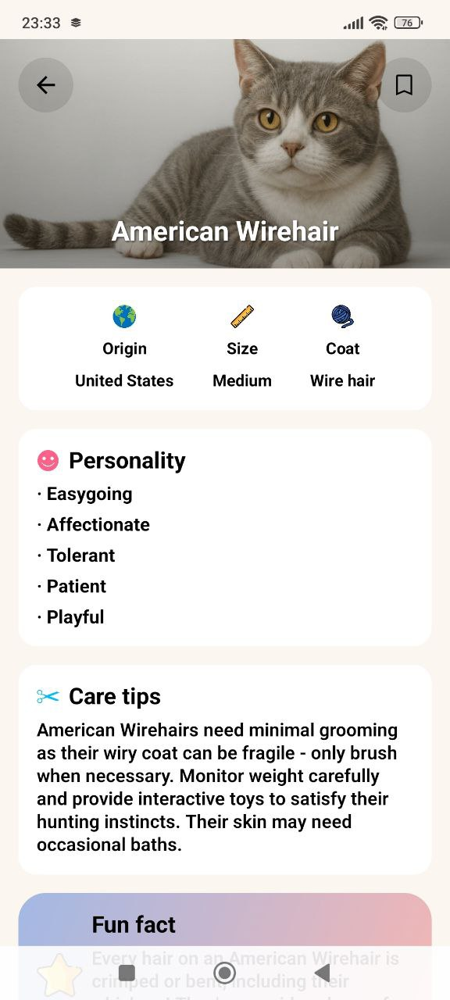
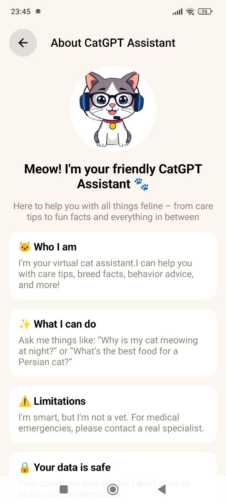
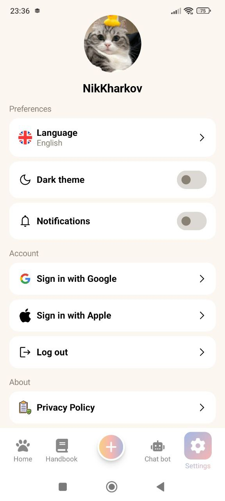

# Meowly 🐱

**Meowly** is a comprehensive cross-platform application for cat lovers built with Kotlin Multiplatform. Track your beloved pets, explore cat breed information, stay updated with latest cat news, chat with AI about cats, and manage private pet galleries with cloud storage.

## Features 🐾

### 🏠 Pet Management
- **Pet Profiles**: Add and manage detailed profiles for your cats
- **Local Storage**: SQLDelight database for offline pet data
- **Pet Gallery**: Private Firebase Storage galleries for each pet
- **Photo Sharing**: Share pet photos to social media platforms
- **Edit & Update**: Modify pet information anytime

### 📚 Cat Breed Handbook
- **78 Breed Records**: Comprehensive database of cat breeds worldwide
- **Detailed Information**: General info and care instructions for each breed
- **Smart Search**: Filter by country, name, and coat length
- **Favorites System**: Save preferred breeds for quick access
- **Offline Access**: Browse breeds without internet connection

### 📰 Cat News Feed
- **Real-time Updates**: Latest cat news from custom Ktor REST API
- **Curated Content**: Hand-picked cat-related articles and updates
- **Smooth Browsing**: Optimized news reading experience
- **Auto-refresh**: Stay updated with newest content

### 🤖 AI Chat Assistant
- **OpenAI Integration**: Smart chatbot for cat-related questions
- **Chat History**: Persistent conversation storage
- **Image Generation**: AI-powered cat image creation
- **Download Images**: Save generated images to device gallery

### ⚙️ Settings & Personalization
- **Multi-language Support**: English and Russian localization
- **Theme Options**: Light and dark mode support
- **Authentication**: Firebase Auth with Google and Apple Sign-In
- **Privacy Controls**: Manage data and notification preferences

### 📊 Analytics & Monetization
- **Firebase Analytics**: User behavior tracking and insights
- **Google Ads Integration**: Native and banner advertisements
- **Performance Monitoring**: App usage analytics

## Screenshots 📱

| Main Menu                     | Add Pet                         | Pet Gallery                         |
|-------------------------------|---------------------------------|-------------------------------------|
|  |  |  |

| Gallery Selection                                     | Cat Handbook                          | Handbook Details                                      |
|-------------------------------------------------------|---------------------------------------|-------------------------------------------------------|
|  |  |  |

| Handbook Search                                     | Saved Breeds                                      | Cat News                      |
|-----------------------------------------------------|---------------------------------------------------|-------------------------------|
|  |  |  |

| AI Chatbot                          | Chatbot About                                   | Settings                              |
|-------------------------------------|-------------------------------------------------|---------------------------------------|
|  |  |  |

## Cross-Platform Architecture 🌐

### Unified Experience
- **Consistent UI**: Identical interface across Android and iOS
- **Shared Business Logic**: Common codebase for all platforms
- **Platform-Specific Features**: Native integrations where needed

## Tech Stack 🛠️

### Core Technologies
- **Language**: Kotlin
- **UI**: Compose Multiplatform
- **Database**: SQLDelight
- **Navigation**: Compose Navigation + Type safe navigation
- **DI**: Koin

### Backend & Cloud Services
- **Database**: SQLDelight (local) + Firebase Storage (cloud galleries)
- **Authentication**: Firebase Auth with Google/Apple Sign-In
- **Analytics**: Firebase Analytics + Google Ads
- **API**: Custom Ktor REST API for news
- **AI**: OpenAI API for chat and image generation
- **Notifications**: KMPNotifier cross-platform

### Key Libraries
- **Networking**: Ktor Client with OkHttp (Android) / Darwin (iOS)
- **Image Handling**: Coil 3 + Peekaboo Image Picker + FileKit for saving generated images
- **Animations**: Compottie (Lottie for Compose)
- **Permissions**: Moko Permissions
- **Date/Time**: KMP Date Time Picker
- **Shared preferences**: Multiplatform Settings
- **Serialization**: Kotlinx Serialization JSON

---

*Everything your cat needs, in one purrfect app! 🐱💕*